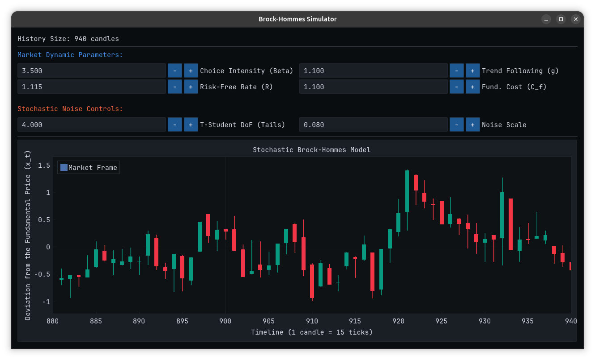

# Stochastic Brock-Hommes Model Simulator

Multithreaded market simulator implementing stochastic version of Brock-Hommes model. The project demonstrates low-latency engineering with lock-free structures and realtime UI rendering by a graphical thread fed by a ring buffer. 



## Mathematical Framework & Model Specification

The simulation is based on the seminal paper by **William A. Brock and Cars G. Hommes (1998)**: *"Heterogeneous beliefs and routes to chaos in a simple asset pricing model"* (Journal of Economic Dynamics and Control).

This model shows how dynamically changing heterogeneous beliefs and strategies generate chaotic price fluctuations. Each agent has a chance of changing his strategy based on past returns.

Let $x_t$ be the asset price deviation from its fundamental value at time $t$, where the fundamental value is a constant. 

### 1. The equilibrium price dynamic
The equilibrium price deviation $x_t$ is determined by the proportion of the **Trend Chasers**, previous price and the interest rate:

$$x_t = \frac{n_{c,t-1} \cdot g \cdot x_{t-1}}{R} + \epsilon_t$$

Where:
* $n_{c,t-1}$ is the percentage of the population adopting the **Trend Chaser** strategy in the previous period.
* $g$ is the **Trend Following Intensity** parameter (`trend_following_intensity`).
* $R$ is the discounting factor ($R = 1 + r$, where $r$ is the risk-free interest rate).
* $\epsilon_t$ is the statistical noise, representing exogenous market shocks:
  $$\epsilon_t \sim \text{Student-t}(\nu) \cdot \sigma$$

*(Note: Fundamentalists believe the price will return to its fundamental value, meaning their forecast for deviation is $f_f(x_{t-1}) = 0$, hence they are not included in the numerator).*

### 2. Changing strategies
Strategies are reevaluated at each step of the simulation by calculating their economic utility, which equals the realised return of the strategy minus its operational costs:

* **Fundamentalist Utility ($U_{f,t}$):**
  $$U_{f,t} = (x_t - R x_{t-1})(-R x_{t-1}) - C_f$$

* **Trend Chaser Utility ($U_{c,t}$):**
  $$U_{c,t} = (x_t - R x_{t-1})(g x_{t-2} - R x_{t-1}) - C_c$$

Where $C_f$ is the cost of fundamental research (`fundamentalist_cost`) and $C_c$ is the cost of trend following (typically set to $0$ as it represents pure momentum-based trading). Note that by decreasing the cost of information $C_f$ the market fluctuations decrease.

### 3. Strategy Selection
Agents decide whether to change their strategies each step. The probability $P_{f,t}$ of an agent choosing the Fundamentalist strategy follows an evolutionary Softmax distribution:

$$P_{f,t} = \frac{e^{\beta U_{f,t}}}{e^{\beta U_{f,t}} + e^{\beta U_{c,t}}}$$

The parameter $\beta$ denotes the **Intensity of Choice** (`choice_intensity`).
* As $\beta \to 0$, agents distribute randomly across strategies regardless of profits (high bounded rationality).
* As $\beta \to \infty$, agents instantly and deterministically adopt the single most profitable strategy, causing highly non-linear bifurcations, severe market crashes, and complex chaotic attractors.


## Build Instructions (Linux / macOS)


```bash
git clone https://github.com/m-koska/gui-market-agent-model.git
cd gui-market-agent-model
cmake -B build -S . -DCMAKE_BUILD_TYPE=Release
cmake --build build --config Release -j 14
./build/agent_model
```